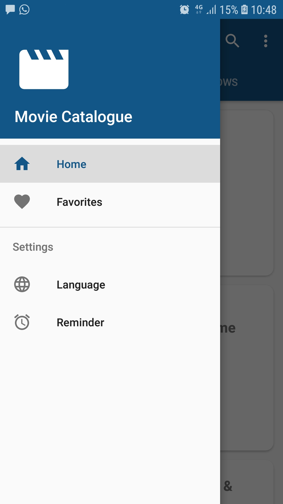
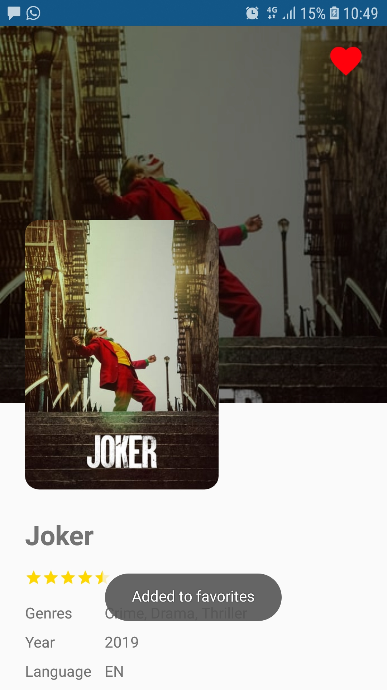
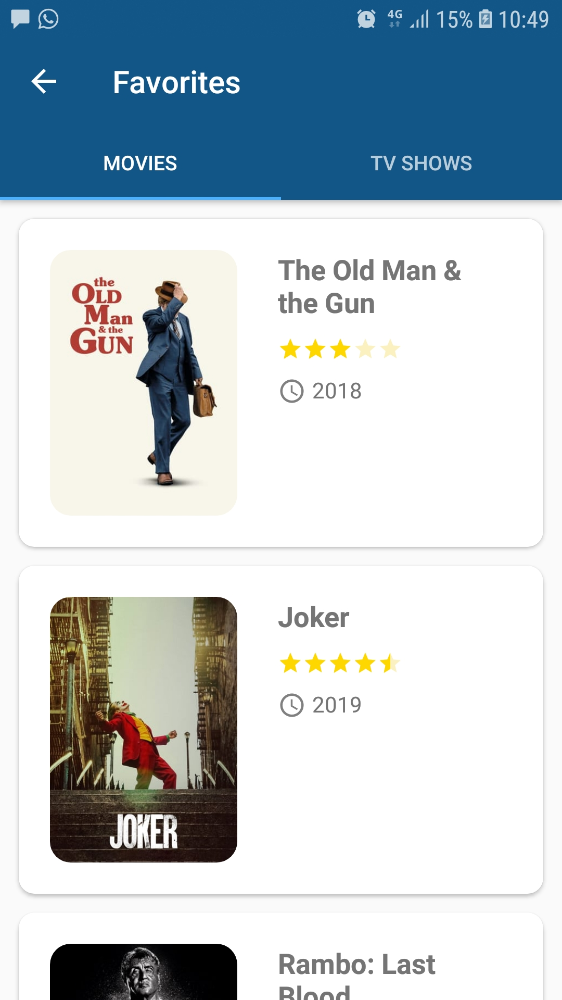
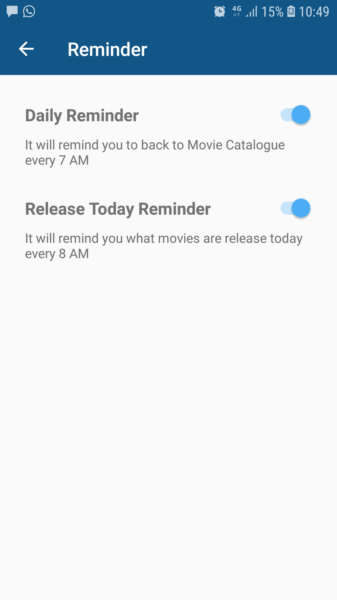
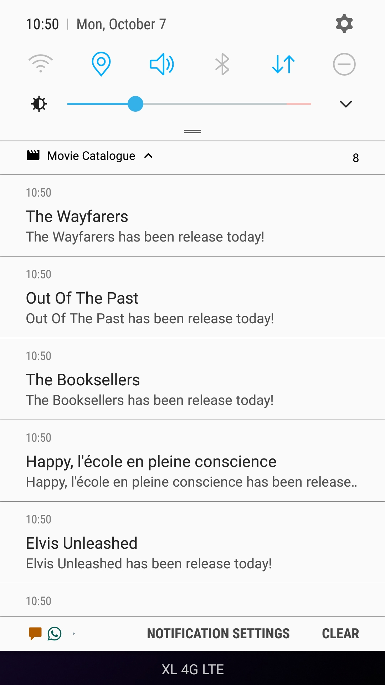
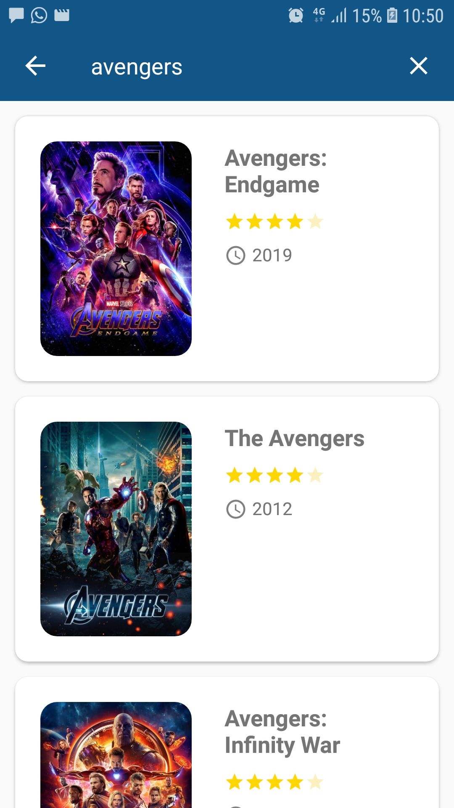
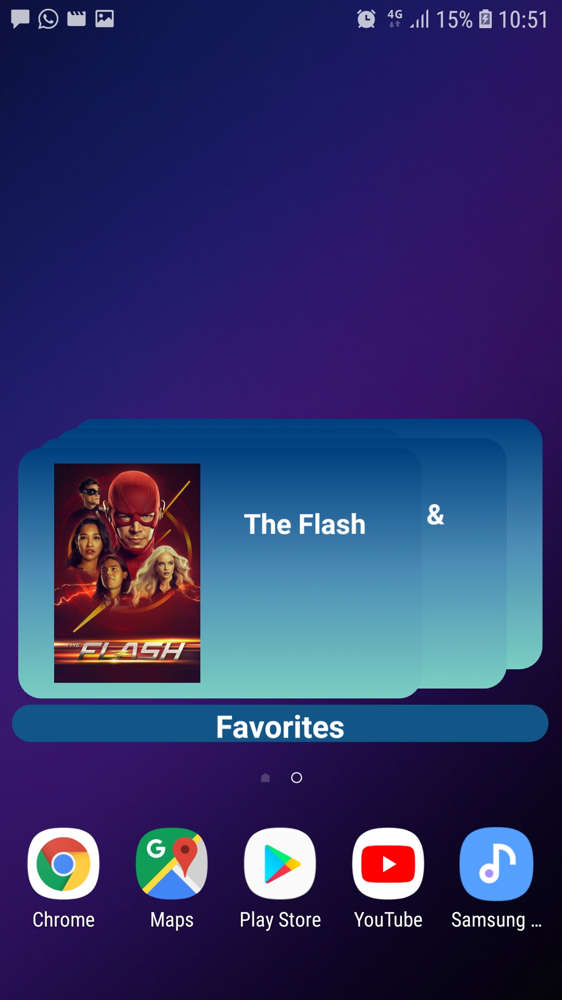

# MovieCatalogue
Proyek akhir kelas Menjadi Android Developer Expert (Dicoding)

> API KEY The Movie Database (TMDb) pada file gradle.properties perlu diisi.

 

## Halaman utama

    

 

## Navigasi (Navigation Drawer)

    

 

## Halaman Detail item

    

 

## Halaman list favorit

    

 

## Halaman Pengaturan pengingat

    

 

## Notifikasi pengingat film rilis hari ini

    

 

## Search film/acara TV

    

 

## Widget list favorit

    

